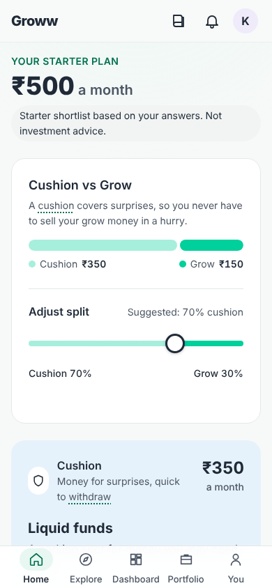
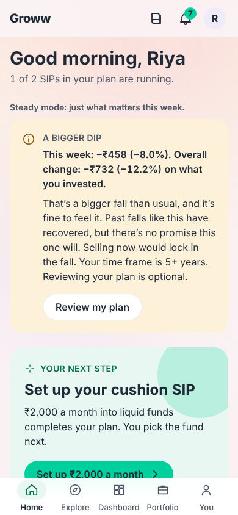
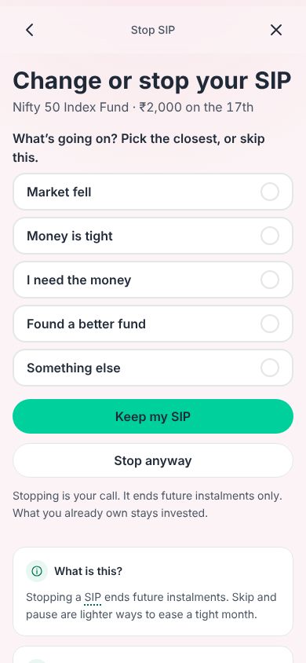
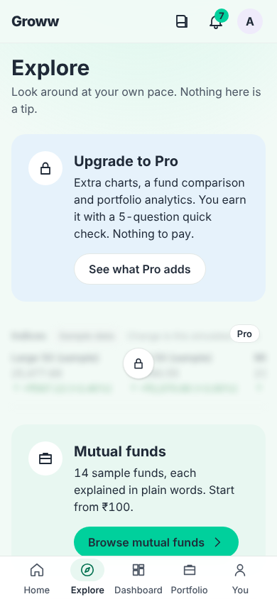

# Groww Starter: reviewer guide

This file is the overview for reviewers. `README.md` is the full build spec used to build the app, and it is unchanged.

## What it is

Groww Starter is a clickable prototype of a beginner mode inside Groww, designed for first-time investors aged 20–26. It turns a small, uneven income into a lasting habit. It explains every money decision and offers skip, pause or change at the moment a user wants to stop. No real money, data or accounts are involved. Every number is sample data.

**Live app:** https://ayanshs007.github.io/groww-starter/

| Starter plan | Home, Steady mode | Stop coach | Explore, Pro locked |
|---|---|---|---|
|  |  |  |  |

All 16 screenshots (8 screens at 390 and 1280 px) are in [`docs/screenshots/`](docs/screenshots/).

## Review in 2 minutes

1. Open the live app. On the Landing page, tap **Reviewer? Load a demo**.
2. **Load Riya.** Home opens in Steady mode: a calm card about a bigger dip comes first. Open her SIP and tap **Stop SIP** to see the Stop coach. **Stop anyway** is always visible and the same size.
3. **Load Meera.** Open Portfolio, then Goals, to see the laptop goal and the monthly amount it needs. In Reviewer tools, tap **Advance one week**. A milestone card appears on Home with a **Got it** button.
4. **Mood control.** In Reviewer tools, use the Mood chips (Up week, Flat, Small dip, Big dip) to preview every market state.
5. **Unlock Pro.** In Reviewer tools, tap **Unlock Pro**, then open Explore. Pro features are locked until then.

Reviewer tools is also a tab on the right edge on desktop. Use **Advance one week** to move the simulated calendar. Skip, pause and edit close inside the 3-business-day cutoff.

## Key features

**Start**
- Money check-in: six questions, one per screen, with a "Why we ask" line.
- Starter plan: an Emergency fund part and a Long-term investing part, shown as fund categories. The user picks the fund.
- Adjust split slider and a one-pass setup for both SIPs, from ₹100.

**Stay invested**
- Flex SIP: skip, pause, change the amount or date, step up yearly, with a real autopay cutoff.
- Stop coach: one screen, reasons first, "Stop anyway" always shown.
- Weekly dip insight in calm, number-based words, and Steady mode for big dips.
- Payday Split and milestone cards. There are no streaks.

**Understand**
- Confidence Layer on money screens: What is this? Why am I seeing this? What happens next?
- Tap-to-explain glossary terms, goals with the monthly amount needed, plan health.
- Dashboard with only the user's own money and plan.

**Safety**
- Tip Check for tips from friends and social media.
- Beginner stock mode (delivery only), a user-set stock budget, and Pro earned by a 5-question quick check.
- No advice wording, and all market numbers labelled as sample data.

**Feel**
- The look follows the market mood and time of day. Losses use a soft rose with ▼ and a sign, never alarm red.
- Light and dark themes, no confetti, no countdowns.

The reasoning behind each choice is in [`FEASIBILITY.md`](FEASIBILITY.md) (what could ship, and what would change).

## Submission artifacts

All four artifacts are collected in [`submission/`](submission/README.md).

| Artifact | Where | Status |
|---|---|---|
| One-pager | [`submission/1_ONE_PAGER/ONE_PAGER_Groww_Starter.pdf`](submission/1_ONE_PAGER/ONE_PAGER_Groww_Starter.pdf) | Written by the author. |
| Prompts | [`submission/2_PROMPTS/PROMPT_LOG.md`](submission/2_PROMPTS/PROMPT_LOG.md) (prompts sent) and [`submission/2_PROMPTS/PROMPTS.md`](submission/2_PROMPTS/PROMPTS.md) (stage prompts) | Present |
| Evals | [`submission/3_EVALS/README.md`](submission/3_EVALS/README.md) | Layers explained, with feedback from 4 real users ([`EVALS.md`](submission/3_EVALS/EVALS.md)). |
| App link | https://ayanshs007.github.io/groww-starter/ ([`submission/4_APP/APP_LINK.md`](submission/4_APP/APP_LINK.md)) | Live. Steps to publish and check it are in [`DEPLOY.md`](DEPLOY.md). |

## How it was built

The app was built in stages with Claude Code from a written spec. Each stage ran in its own session on its own branch, and each was reviewed as a pull request before merging.

- [`README.md`](README.md): the build spec.
- [`PLAN.md`](PLAN.md): the plan approved at Stage 1, plus later changes to the spec.
- [`PROMPT_LOG.md`](PROMPT_LOG.md): every prompt sent, with what happened and what changed next.
- [`PROMPTS.md`](PROMPTS.md): the stage-by-stage prompt guide.
- [`CHANGELOG.md`](CHANGELOG.md): every decision, one line each.
- [`CLAUDE.md`](CLAUDE.md): the working rules the agent follows.

## Tech stack

Vite 5, React 18, TypeScript (strict), Tailwind CSS 3, Vitest 2. Hash routing with a small custom router. State in one `useReducer`, saved to one `localStorage` key. Charts and icons are hand-written inline SVG. System fonts only. The app makes no network calls. `npm run build` also writes a single self-contained `dist/index.html`.

## Run locally

```bash
npm ci            # install
npm run dev       # dev server
npm test          # Vitest: 1,365 tests in 42 files at the time of writing
npm run build     # type check, build, and check the single-file output
npm run preview   # serve the build
```

`release/groww-starter.html` is a committed copy of the single-file build. It opens on its own, with no server.

## Repo map

| Path | What is in it |
|---|---|
| `src/screens/` | One file per screen |
| `src/components/` | Shared UI parts (sheets, cards, charts, shell) |
| `src/lib/` | Pure logic with a test file each: planner, insight, Stop coach, cutoff, Payday Split, goals and more |
| `src/data/` | Sample funds, stocks, glossary, demo personas |
| `src/state/` | Store, reducer, storage |
| `docs/screenshots/` | Screenshots at 390 and 1280 px |
| `evals/` | Eval layers, persona scripts, user-test script |
| `submission/` | The four submission artifacts, in numbered folders (copies of the working files) |
| `design-refs/` | Visual references (read-only) |
| `release/` | Single-file build |
| `.github/workflows/` | GitHub Pages deploy |
| `FEASIBILITY.md` | Feature-by-feature real-world check |
